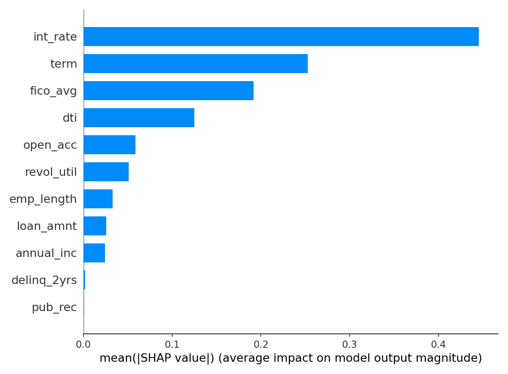

# Credit Risk Model — End-to-End PD & Expected Loss Framework

An end-to-end credit risk modeling project built on real-world Lending Club loan data. Covers the full lifecycle from raw data ingestion to a deployable scoring model with business-ready outputs — mirroring workflows used at banks and consumer lending firms.

---

## Project Overview

| Item | Detail |
|---|---|
| **Dataset** | Lending Club Accepted Loans 2007–2018 (Kaggle) |
| **Rows (raw)** | 54,081 loans × 151 features |
| **Rows (clean)** | 44,539 loans × 27 features |
| **Default Rate** | 20.49% (9,748 defaults / 37,837 good loans) |
| **Model** | Logistic Regression with StandardScaler |
| **AUC-ROC** | 0.7280 |
| **Gini Coefficient** | 0.4560 |
| **KS Statistic** | 0.3343 |

---

## Tech Stack

- **Python** (Google Colab) — data cleaning, modeling, SHAP explainability
- **MySQL** (MySQL Workbench) — feature engineering via SQL Views
- **Excel** — analyst workbook, stress testing, pivot reporting
- **Tableau Public** — interactive risk dashboard *(link coming soon)*
- **Libraries** — pandas, scikit-learn, scorecardpy, shap, matplotlib

---

## Project Structure

```
credit_risk_model/
│
├── Finance_data_prep_with_comments.ipynb   # Full Colab notebook (cleaning + modeling)
│
├── loans_clean.csv          # Cleaned dataset (44,539 rows, 27 columns)
├── loans_features.csv       # SQL-engineered features (44,417 rows, 17 columns)
├── loans_scored.csv         # Test set with PD, EAD, Expected Loss, Risk Grade
├── el_by_grade.csv          # Expected Loss aggregated by risk grade (A→G)
├── el_by_vintage.csv        # Expected Loss aggregated by vintage year
│
├── shap_summary.png         # SHAP feature importance plot
└── loans_scored_excel_workbook.xlsx  # Analyst workbook with stress testing
```

---

## Methodology

### Phase 1 — Data Collection
- Downloaded Lending Club dataset from Kaggle (`accepted_2007_to_2018Q4.csv`)
- Supplemented with Fed Funds Rate macro data from FRED

### Phase 2 — Data Cleaning
- Selected 24 relevant features from 151 raw columns
- Created binary `target` variable: 1 = Default, 0 = Fully Paid
- Filtered to "Fully Paid" and "Charged Off/Default" loans only
- Engineered `vintage_year` and `fico_avg` features
- Parsed dates, fixed data types, dropped missing values

### Phase 3 — SQL Feature Engineering (MySQL)
Created a SQL VIEW `loans_features` with three engineered features:
- `dti_quartile` — ranks borrowers into 4 risk buckets by debt-to-income ratio
- `fico_tier` — categorizes borrowers: Prime / Near-Prime / Subprime / Deep-Subprime
- `high_risk_flag` — flags borrowers with high DTI AND prior delinquencies

### Phase 4 — Modeling
- Calculated Information Value (IV) for all features using `scorecardpy`
- Top predictors: `pub_rec`, `delinq_2yrs`, `annual_inc`, `loan_amnt`, `fico_avg`
- Trained Logistic Regression with 80/20 train/test split
- Generated SHAP values — `int_rate` was the #1 default driver

### Phase 5 — Expected Loss Framework
Applied the Basel II Expected Loss formula:

```
Expected Loss = PD × LGD × EAD
```

- **PD** — predicted by logistic regression model
- **LGD** — fixed at 45% (industry standard for unsecured consumer loans)
- **EAD** — loan amount outstanding

**Portfolio Results:**
- Average PD: 20.27%
- Average Expected Loss: $1,455 per loan
- Total Portfolio EL: $12,932,182

---

## Key Results

| Risk Grade | Avg PD | Total Expected Loss |
|---|---|---|
| A | 7.0% | $801,591 |
| B | 13.1% | $2,109,320 |
| C | 21.7% | $3,605,421 |
| D | 33.2% | $2,820,299 |
| E | 46.0% | $2,296,018 |
| F | 62.5% | $1,041,602 |
| G | 71.3% | $257,931 |

---

## SHAP Explainability



Top drivers of default prediction:
1. `int_rate` — higher interest rate = higher default risk
2. `fico_avg` — lower FICO score = higher default risk
3. `annual_inc` — lower income = higher default risk
4. `pub_rec` — prior public records increase default probability
5. `delinq_2yrs` — recent delinquencies are strong default signals

---

## Tableau Dashboard
(https://public.tableau.com/app/profile/himanshu.kanchap/viz/credit_risk_project/Dashboard1)

Charts included:
- Expected Loss by Risk Grade
- PD vs Actual Default Rate by Grade
- EL by Vintage Year
- Loan Risk Distribution

---

## About
Built as a portfolio project to demonstrate end-to-end credit risk modeling skills relevant to roles in risk analytics, credit risk, and quantitative finance.
